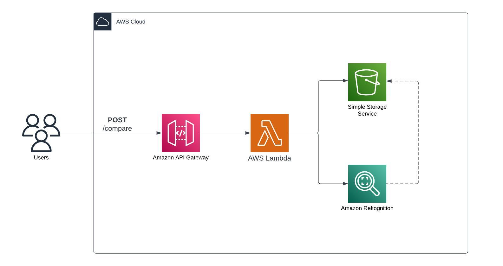

# Astounding Results: Highly Accurate Face Comparison Using AI

This is a demo project which accompanies the article at https://medium.com/@dfernaro/astounding-results-highly-accurate-face-comparison-using-ai-d70531685a2b.

Please, make sure that you update the file `bin/sample-face-recognition.ts` which contains the AWS account and region.

The `cdk.json` file tells the CDK Toolkit how to execute your app.

# AWS Diagram

## Useful commands

- `npm run build` compile typescript to js
- `npm run watch` watch for changes and compile
- `npm run test` perform the jest unit tests
- `cdk deploy` deploy this stack to your default AWS account/region
- `cdk diff` compare deployed stack with current state
- `cdk synth` emits the synthesized CloudFormation template
